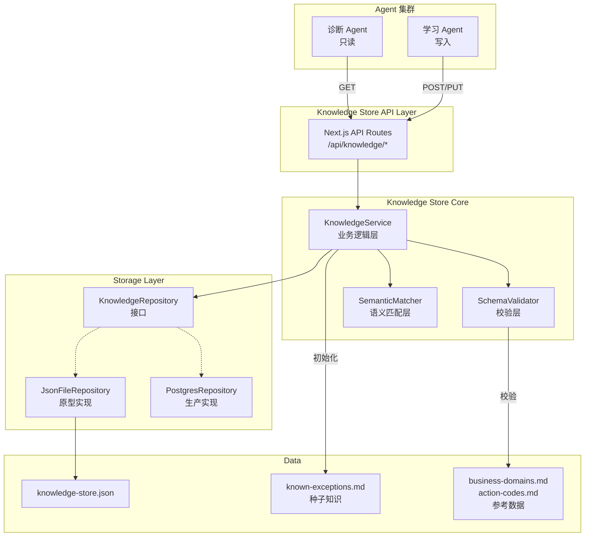
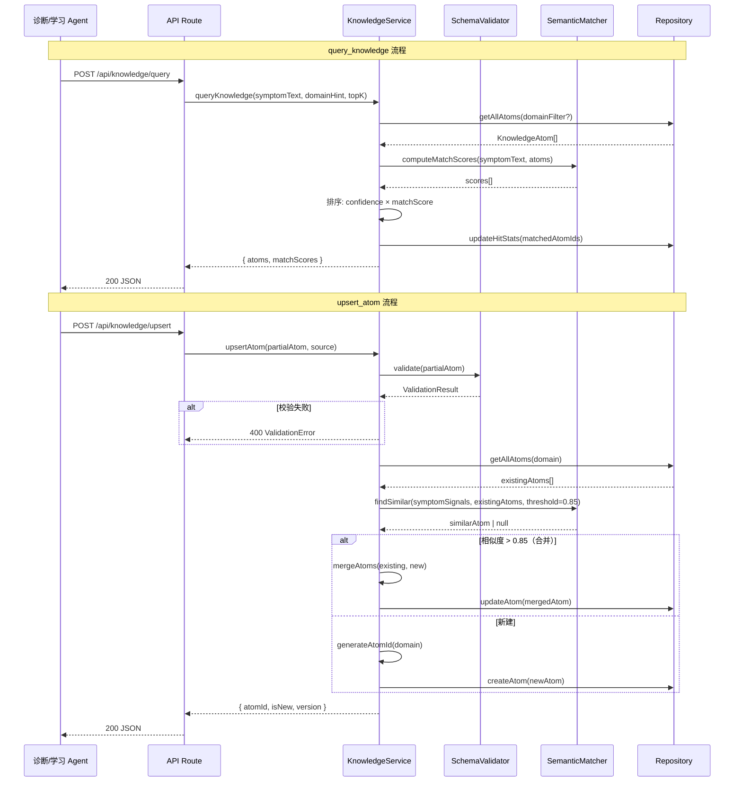

# 技术设计文档：OMS 异常知识结构化 Agent（记忆体）

## 概述

本设计文档描述 OMS 异常处理 Agent 集群的核心记忆体——知识存储与检索系统的技术实现方案。

系统定位为纯粹的知识存储层，提供 5 个标准接口（`query_knowledge`、`get_atom`、`list_by_domain`、`upsert_atom`、`deprecate_atom`），供诊断 Agent（只读）和学习 Agent（写入）调用。

### 关键设计目标

1. **存储层可替换**：通过 Repository 抽象，原型阶段使用本地 JSON 文件，生产阶段无缝切换到 PostgreSQL + pgvector
2. **语义匹配能力**：基于 TF-IDF 向量相似度 + 关键词匹配实现 `query_knowledge` 的语义搜索
3. **去重合并**：语义相似度 > 0.85 时自动合并知识原子，避免重复
4. **严格 Schema 校验**：所有写入必须通过完整的 KnowledgeAtom 校验
5. **种子知识预加载**：启动时从 `known-exceptions.md` 解析并加载 11 个已知异常模式

### 技术栈

- **运行时**：Next.js 14 API Routes（App Router）
- **语言**：TypeScript（strict mode）
- **原型存储**：本地 JSON 文件（`data/knowledge-store.json`）
- **生产存储**：PostgreSQL + pgvector（通过 Repository 接口切换）
- **语义匹配**：自实现 TF-IDF 向量化 + 余弦相似度（原型阶段），生产阶段可替换为 OpenAI Embeddings + pgvector
- **测试**：Vitest + fast-check（属性测试）

---

## 架构

### High-Level 架构



### 分层架构

系统采用三层架构，每层职责清晰：

| 层级 | 职责 | 模块 |
|------|------|------|
| API 层 | HTTP 路由、请求/响应序列化 | Next.js API Routes |
| 服务层 | 业务逻辑、校验编排、语义匹配 | KnowledgeService |
| 存储层 | 数据持久化、CRUD 操作 | KnowledgeRepository |

### 请求流程



---

## 组件与接口

### 1. KnowledgeRepository（存储层接口）

存储层的抽象接口，定义所有数据访问操作。原型阶段由 `JsonFileRepository` 实现，生产阶段由 `PostgresRepository` 实现。

```typescript
interface KnowledgeRepository {
  // 读操作
  getAtomById(atomId: string): Promise<KnowledgeAtom | null>;
  getAtomsByDomain(domain: string, includeDeprecated?: boolean): Promise<KnowledgeAtom[]>;
  getAllAtoms(includeDeprecated?: boolean): Promise<KnowledgeAtom[]>;

  // 写操作
  createAtom(atom: KnowledgeAtom): Promise<void>;
  updateAtom(atom: KnowledgeAtom): Promise<void>;

  // 持久化
  flush(): Promise<void>;
}
```

### 2. JsonFileRepository（原型实现）

- 启动时从 `data/knowledge-store.json` 加载全部数据到内存
- 所有读操作直接从内存 Map 中查询
- 写操作更新内存后立即调用 `flush()` 同步到 JSON 文件
- JSON 文件格式化为人类可读（2 空格缩进）

```typescript
class JsonFileRepository implements KnowledgeRepository {
  private atoms: Map<string, KnowledgeAtom>;
  private filePath: string;

  constructor(filePath: string);
  async initialize(): Promise<void>;  // 从文件加载
  // ... 实现 KnowledgeRepository 接口
}
```

### 3. SchemaValidator（校验层）

负责 KnowledgeAtom 的结构校验，包括：

```typescript
interface ValidationResult {
  valid: boolean;
  errors: ValidationError[];
}

interface ValidationError {
  field: string;
  message: string;
  code: string;
}

class SchemaValidator {
  constructor(validDomains: string[], validActionCodes: string[]);

  validate(atom: Partial<KnowledgeAtom>): ValidationResult;
  validateDomain(domain: string): boolean;
  validateActionCodes(actions: string[]): ValidationResult;
  validateConfidence(value: number): boolean;
  validateProbability(value: number): boolean;
}
```

校验规则：
- `domain` 必填，且必须在 24 个标准 Domain_Code 中
- `symptom_signals` 必填，且不能为空数组
- `recommended_actions` 中每个编码必须在 17 个标准 Action_Code 中
- `confidence` 必须在 [0.0, 1.0] 闭区间
- `likely_root_causes` 中每个 `probability` 必须在 [0.0, 1.0] 闭区间

### 4. SemanticMatcher（语义匹配层）

负责症状文本的语义匹配和相似度计算。

```typescript
interface MatchResult {
  atom: KnowledgeAtom;
  score: number;
}

class SemanticMatcher {
  // 计算 symptomText 与一组原子的匹配分数
  computeMatchScores(symptomText: string, atoms: KnowledgeAtom[]): MatchResult[];

  // 在已有原子中查找语义相似的（用于去重合并）
  findSimilar(
    symptomSignals: string[],
    existingAtoms: KnowledgeAtom[],
    threshold: number
  ): KnowledgeAtom | null;

  // 计算两组症状信号的语义相似度
  computeSimilarity(signalsA: string[], signalsB: string[]): number;
}
```

**原型阶段匹配算法**：

1. **关键词匹配**（权重 0.6）：将 symptomText 分词后与每个原子的 `symptom_signals` 做 Jaccard 相似度
2. **TF-IDF 向量相似度**（权重 0.4）：对所有原子的 symptom_signals 构建 TF-IDF 向量空间，计算查询文本与每个原子的余弦相似度
3. **综合分数** = 关键词分数 × 0.6 + TF-IDF 分数 × 0.4

**生产阶段可替换为**：OpenAI text-embedding-3-small + pgvector 余弦距离

### 5. KnowledgeService（业务逻辑层）

编排校验、匹配、存储操作的核心服务。

```typescript
interface QueryResult {
  atoms: KnowledgeAtom[];
  matchScores: number[];
}

interface UpsertResult {
  atomId: string;
  isNew: boolean;
  version: number;
}

class KnowledgeService {
  constructor(
    repository: KnowledgeRepository,
    validator: SchemaValidator,
    matcher: SemanticMatcher
  );

  // 读接口
  async queryKnowledge(symptomText: string, domainHint?: string, topK?: number): Promise<QueryResult>;
  async getAtom(atomId: string): Promise<KnowledgeAtom | null>;
  async listByDomain(domain: string, includeLowConfidence?: boolean): Promise<KnowledgeAtom[]>;

  // 写接口
  async upsertAtom(atom: Partial<KnowledgeAtom>, source: AtomSource): Promise<UpsertResult>;
  async deprecateAtom(atomId: string, reason: string): Promise<boolean>;

  // 初始化
  async initializeSeedKnowledge(): Promise<void>;
}
```

### 6. SeedLoader（种子知识加载器）

负责解析 `known-exceptions.md` 并转换为 KnowledgeAtom 格式。

```typescript
class SeedLoader {
  // 解析 known-exceptions.md 为 KnowledgeAtom 数组
  static parseKnownExceptions(markdownContent: string): KnowledgeAtom[];

  // 加载种子知识到 repository
  static async loadSeeds(
    repository: KnowledgeRepository,
    seedFilePath: string
  ): Promise<{ loaded: number; errors: string[] }>;
}
```

### 7. API Routes（Next.js App Router）

| 路由 | 方法 | 功能 | 对应接口 |
|------|------|------|----------|
| `/api/knowledge/query` | POST | 语义查询 | query_knowledge |
| `/api/knowledge/atoms/[id]` | GET | 精确获取 | get_atom |
| `/api/knowledge/domains/[domain]` | GET | 按域列举 | list_by_domain |
| `/api/knowledge/upsert` | POST | 写入/合并 | upsert_atom |
| `/api/knowledge/atoms/[id]/deprecate` | POST | 废弃标记 | deprecate_atom |

---

## 数据模型

### KnowledgeAtom（完整 Schema）

```typescript
interface KnowledgeAtom {
  // 标识
  atom_id: string;                    // "KA-{domain}-{seq}", e.g. "KA-ORDER_DISPATCH-001"
  version: number;                    // 从 1 开始，每次更新 +1
  created_at: string;                 // ISO 8601
  updated_at: string;                 // ISO 8601
  source: AtomSource;

  // 核心三要素
  domain: string;                     // 标准 Domain_Code
  symptom_signals: string[];          // 英文 OMS 术语
  likely_root_causes: RootCause[];
  recommended_actions: string[];      // 标准 Action_Code

  // 语义上下文
  context: AtomContext;

  // 元数据
  confidence: number;                 // [0.0, 1.0]
  hit_count: number;
  last_hit_at: string | null;
  tags: string[];

  // 废弃标记（扩展字段）
  deprecated: boolean;
  deprecated_at?: string;
  deprecated_reason?: string;
}

interface RootCause {
  description: string;                // 中文
  description_en: string;             // 英文 OMS 术语
  probability: number;                // [0.0, 1.0]
}

interface AtomContext {
  related_modules: string[];
  related_processes: string[];
  related_rules: string[];
  state_transitions: string[];
  entry_conditions: string[];
  recovery_paths: string[];
}

type AtomSource =
  | { type: "knowledge_graph"; node_ids: string[] }
  | { type: "codebase"; file_paths: string[] }
  | { type: "document"; doc_name: string }
  | { type: "runtime_learning"; incident_id: string }
  | { type: "manual"; author: string };
```

### 参考数据常量

```typescript
// 24 个标准业务域
const VALID_DOMAINS: string[] = [
  "ORDER_CREATE", "ORDER_DISPATCH", "ORDER_UPDATE", "ORDER_CANCEL",
  "ORDER_HOLD", "ORDER_WMS_SYNC", "ORDER_FULFILLMENT", "ORDER_DELIVERY",
  "ORDER_RETURN", "ORDER_EXCHANGE", "ORDER_MERGE", "ORDER_PO",
  "ORDER_WORK_ORDER", "SHIPMENT", "INVENTORY_SYNC", "INVENTORY_ALLOCATION",
  "ITEM_SYNC", "ITEM_PUBLISH", "CHANNEL_INTEGRATION", "NOTIFICATION",
  "RATE_SHOPPING", "CUSTOMS", "SYSTEM", "UNKNOWN"
];

// 17 个标准动作编码
const VALID_ACTION_CODES: string[] = [
  "RETRY_WITH_BACKOFF", "RETRY_IMMEDIATE", "MAP_ITEM_ID",
  "SYNC_ITEM_MASTER", "RESYNC_ORDER", "RESYNC_INVENTORY",
  "RECALCULATE_INVENTORY", "REFRESH_CHANNEL_TOKEN",
  "REPUBLISH_TO_CHANNEL", "NOTIFY_MERCHANT", "CANCEL_AND_RECREATE",
  "ESCALATE_TO_ENGINEERING", "ESCALATE_TO_OPS", "MANUAL_DATA_FIX",
  "CONTACT_CHANNEL_SUPPORT", "REVIEW_BUSINESS_RULE",
  "CHECK_THIRD_PARTY_STATUS"
];
```

### JSON 存储文件格式

```json
{
  "version": 1,
  "updated_at": "2025-01-15T10:00:00Z",
  "atoms": [
    {
      "atom_id": "KA-ORDER_DISPATCH-001",
      "version": 1,
      "domain": "ORDER_DISPATCH",
      "symptom_signals": ["Dispatch failure", "No matching warehouse"],
      "..."
    }
  ],
  "metadata": {
    "total_count": 11,
    "domain_counts": {
      "ORDER_DISPATCH": 2,
      "ORDER_CREATE": 1
    }
  }
}
```

### 文件结构

```
lib/
  knowledge-store/
    types.ts                    # KnowledgeAtom, RootCause, AtomSource 等类型定义
    constants.ts                # VALID_DOMAINS, VALID_ACTION_CODES
    schema-validator.ts         # SchemaValidator 实现
    semantic-matcher.ts         # SemanticMatcher 实现（TF-IDF + 关键词）
    knowledge-service.ts        # KnowledgeService 业务逻辑
    seed-loader.ts              # SeedLoader 种子知识解析
    repository/
      interface.ts              # KnowledgeRepository 接口
      json-file-repository.ts   # JSON 文件实现
      index.ts                  # 导出 + 工厂函数
    index.ts                    # 模块入口

app/
  api/
    knowledge/
      query/route.ts            # POST /api/knowledge/query
      upsert/route.ts           # POST /api/knowledge/upsert
      atoms/[id]/
        route.ts                # GET /api/knowledge/atoms/:id
        deprecate/route.ts      # POST /api/knowledge/atoms/:id/deprecate
      domains/[domain]/
        route.ts                # GET /api/knowledge/domains/:domain

data/
  knowledge-store.json          # 持久化 JSON 文件（运行时生成）
```


---

## 正确性属性（Correctness Properties）

*属性（Property）是指在系统所有合法执行路径中都应成立的特征或行为——本质上是对系统应做什么的形式化陈述。属性是人类可读规格说明与机器可验证正确性保证之间的桥梁。*

### Property 1: 必填字段校验拒绝无效输入

*For any* 不包含 `domain` 字段、不包含 `symptom_signals` 字段、或 `symptom_signals` 为空数组的 Partial\<KnowledgeAtom\>，调用 `validate()` 应返回 `valid: false` 并包含对应字段的错误信息。

**Validates: Requirements 1.1, 1.2, 1.3**

### Property 2: Domain 编码校验

*For any* 字符串 `d`，`validateDomain(d)` 返回 `true` 当且仅当 `d` 存在于 24 个标准 `VALID_DOMAINS` 列表中。

**Validates: Requirements 1.4, 9.1**

### Property 3: Action Code 编码校验

*For any* 字符串数组 `actions`，`validateActionCodes(actions)` 返回全部有效当且仅当数组中每个元素都存在于 17 个标准 `VALID_ACTION_CODES` 列表中。

**Validates: Requirements 1.5, 9.2**

### Property 4: 数值范围校验

*For any* 数值 `n`，`validateConfidence(n)` 和 `validateProbability(n)` 返回 `true` 当且仅当 `0.0 <= n <= 1.0`。

**Validates: Requirements 1.6, 1.7**

### Property 5: 新建原子初始化不变量

*For any* 通过 `upsertAtom` 新建的 KnowledgeAtom，其 `atom_id` 应匹配正则 `^KA-{domain}-\d{3,}$`，`version` 应为 1，`hit_count` 应为 0，`last_hit_at` 应为 null。

**Validates: Requirements 1.8, 1.9**

### Property 6: 种子知识不变量

*For any* 通过 `initializeSeedKnowledge()` 加载的 KnowledgeAtom，其 `source.type` 应为 `"knowledge_graph"`，且 `confidence` 应为 0.8。

**Validates: Requirements 2.2, 2.3**

### Property 7: 查询结果按综合分数降序排列

*For any* `queryKnowledge` 调用返回的结果列表，对于相邻的两个结果 `results[i]` 和 `results[i+1]`，应满足 `atoms[i].confidence * matchScores[i] >= atoms[i+1].confidence * matchScores[i+1]`。

**Validates: Requirements 3.1, 3.5**

### Property 8: domain_hint 过滤

*For any* 带有 `domainHint` 参数的 `queryKnowledge` 调用，返回结果中的所有 KnowledgeAtom 的 `domain` 字段应等于 `domainHint`（当该域下存在匹配原子时）。

**Validates: Requirements 3.2**

### Property 9: top_k 限制

*For any* `queryKnowledge` 调用，返回结果的数量应 `<= topK`（默认 5）。

**Validates: Requirements 3.3**

### Property 10: 查询命中更新统计

*For any* `queryKnowledge` 调用返回的非空结果，每个被命中原子的 `hit_count` 应比调用前增加 1，且 `last_hit_at` 应被更新为非 null 值。

**Validates: Requirements 3.4**

### Property 11: get_atom 读写往返

*For any* 已存储的 KnowledgeAtom，通过 `getAtom(atom.atom_id)` 获取的结果应与存储的原子数据完全一致。

**Validates: Requirements 4.1**

### Property 12: get_atom 不更新统计

*For any* `getAtom` 调用，被获取原子的 `hit_count` 和 `last_hit_at` 应保持不变。

**Validates: Requirements 4.3**

### Property 13: list_by_domain 默认过滤

*For any* 不带 `includeLowConfidence` 参数的 `listByDomain` 调用，返回结果中不应包含 `confidence < 0.3` 的原子，也不应包含 `deprecated === true` 的原子。

**Validates: Requirements 5.2, 5.5**

### Property 14: list_by_domain 域过滤

*For any* `listByDomain(domain)` 调用，返回结果中所有原子的 `domain` 字段应等于传入的 `domain` 参数。

**Validates: Requirements 5.1**

### Property 15: include_low_confidence 包含低置信度原子

*For any* `listByDomain(domain, true)` 调用，返回结果应包含该域下所有非 deprecated 的原子，包括 `confidence < 0.3` 的。

**Validates: Requirements 5.3**

### Property 16: 新建 vs 合并判定

*For any* `upsertAtom` 调用，当写入的 `symptom_signals` 与已有原子的语义相似度 > 0.85 时，结果应为 `is_new: false`；当相似度 <= 0.85 时，结果应为 `is_new: true`。

**Validates: Requirements 6.1, 6.2**

### Property 17: 合并保留并组合数据

*For any* 触发合并的 `upsertAtom` 操作，合并后的原子应满足：(a) `likely_root_causes` 包含新旧两方的所有根因（去重），(b) `recommended_actions` 包含新旧两方的所有动作编码（去重），(c) `confidence` 等于 `max(旧.confidence, 新.confidence)`，(d) `version` 等于 `旧.version + 1`，(e) 返回结果的 `is_new` 为 false。

**Validates: Requirements 6.3, 6.4, 6.5, 6.6, 6.7**

### Property 18: 废弃标记保留数据

*For any* 已存在的 KnowledgeAtom，调用 `deprecateAtom(atomId, reason)` 后，该原子应满足 `deprecated === true` 且 `deprecated_reason === reason`，同时通过 `getAtom(atomId)` 仍可获取完整数据。

**Validates: Requirements 7.1, 7.3**

### Property 19: 废弃原子从默认查询中排除

*For any* 已被标记为 deprecated 的 KnowledgeAtom，`queryKnowledge` 和 `listByDomain`（默认参数）的返回结果中不应包含该原子。

**Validates: Requirements 7.4**

### Property 20: 持久化往返

*For any* 通过 `upsertAtom` 或 `deprecateAtom` 写入的变更，重新从 JSON 文件加载后，所有原子数据应与写入前内存中的数据一致。

**Validates: Requirements 8.1, 8.2, 8.3**

### Property 21: Atom_ID 全局唯一

*For any* 知识库状态，所有存储的 KnowledgeAtom 的 `atom_id` 应两两不同。

**Validates: Requirements 9.3**

---

## 错误处理

### 校验错误

| 场景 | HTTP 状态码 | 错误响应 |
|------|------------|----------|
| 缺少必填字段（domain, symptom_signals） | 400 | `{ error: "VALIDATION_ERROR", details: ValidationError[] }` |
| domain 不在标准列表中 | 400 | `{ error: "INVALID_DOMAIN", domain: string }` |
| action_code 不在标准列表中 | 400 | `{ error: "INVALID_ACTION_CODE", codes: string[] }` |
| confidence/probability 超出范围 | 400 | `{ error: "OUT_OF_RANGE", field: string, value: number }` |

### 运行时错误

| 场景 | 处理策略 |
|------|----------|
| JSON 文件不存在 | 创建空文件，以空知识库启动 |
| JSON 文件损坏 | 记录错误日志，尝试从 `.backup` 恢复，无备份则以空知识库启动 |
| 种子知识文件不存在 | 记录警告日志，跳过种子加载，以空知识库启动 |
| 种子知识解析失败 | 记录错误日志，跳过失败的条目，继续加载其余条目 |
| 文件写入失败（磁盘满等） | 抛出错误，API 返回 500，内存状态回滚 |

### 错误响应格式

```typescript
interface ErrorResponse {
  error: string;        // 错误码
  message: string;      // 人类可读的中文描述
  details?: unknown;    // 可选的详细信息
}
```

---

## 测试策略

### 双轨测试方法

本系统采用单元测试 + 属性测试的双轨策略，确保全面覆盖。

### 属性测试（Property-Based Testing）

- **库**：`fast-check`（TypeScript 生态最成熟的 PBT 库）
- **框架**：`vitest`
- **每个属性测试最少运行 100 次迭代**
- **每个测试必须通过注释引用设计文档中的属性编号**

标签格式：`Feature: oms-exception-knowledge-store, Property {N}: {property_text}`

属性测试覆盖范围：
- Property 1-4：Schema 校验（生成随机的 Partial\<KnowledgeAtom\> 输入）
- Property 5：新建原子初始化（生成随机有效原子）
- Property 7, 9：查询排序和 top_k（生成随机知识库 + 随机查询）
- Property 10, 12：统计更新行为（生成随机查询场景）
- Property 13-15：list_by_domain 过滤（生成随机知识库）
- Property 16-17：合并行为（生成相似/不相似的症状信号对）
- Property 18-19：废弃行为（生成随机原子 + 废弃操作）
- Property 20：持久化往返（生成随机写入序列）
- Property 21：ID 唯一性（生成多次写入操作）

### 单元测试

单元测试聚焦于具体示例和边界情况：

- **种子知识加载**：验证 11 个已知异常模式正确解析（需求 2.1, 2.4）
- **边界情况**：
  - 空查询文本（需求 3.6）
  - 不存在的 Atom_ID（需求 4.2, 7.2）
  - 无效 Domain_Code（需求 5.4）
  - 损坏的 JSON 文件（需求 8.5）
  - 不存在的种子文件（需求 2.5）
- **集成测试**：
  - 完整的 upsert → query → get 流程
  - 种子加载 → 查询验证流程
  - 写入 → 重启 → 读取持久化验证

### 测试文件结构

```
__tests__/
  knowledge-store/
    schema-validator.test.ts        # Property 1-4 + 边界用例
    semantic-matcher.test.ts        # 语义匹配算法测试
    knowledge-service.test.ts       # Property 5-21 + 集成测试
    seed-loader.test.ts             # 种子知识解析测试
    json-file-repository.test.ts    # 持久化往返测试
```
