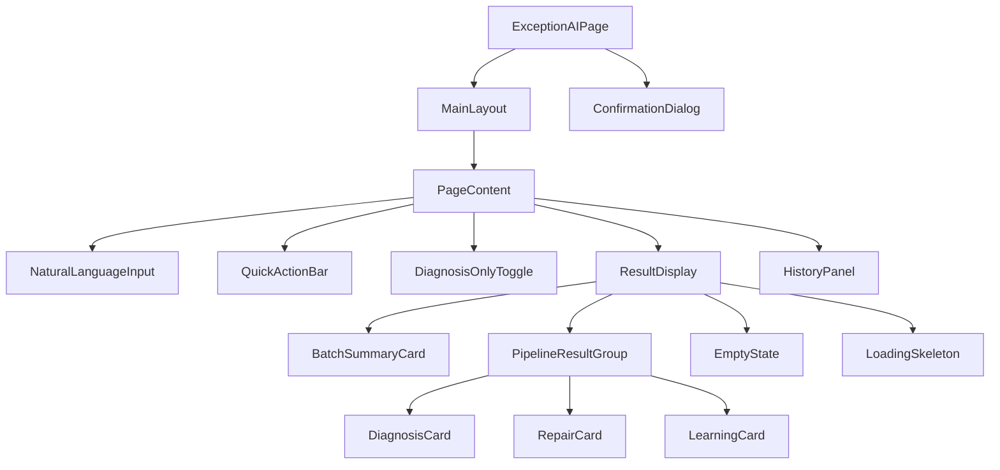
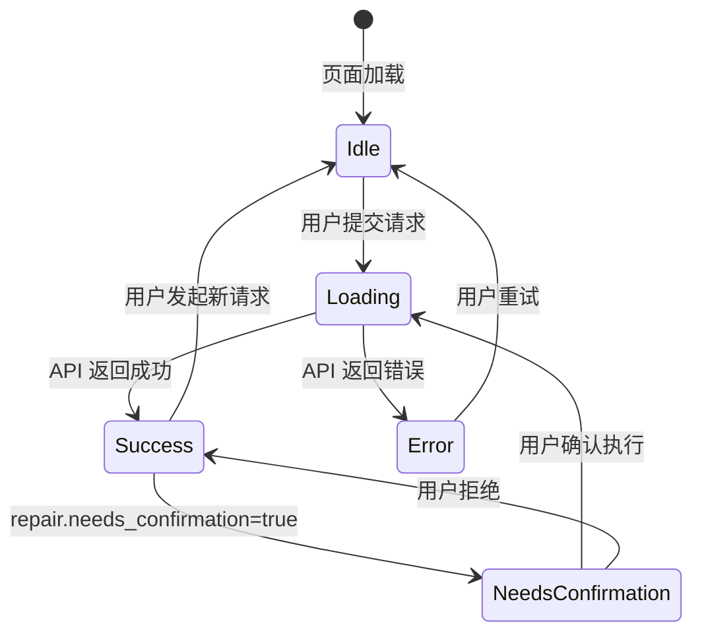

# 设计文档：AI 异常处理面板

## 概述

AI 异常处理面板（Exception AI Panel）是 OMS React 前端的一个交互式页面，路由为 `/orders/exception-ai`。该页面允许运营人员通过自然语言输入或快捷操作触发后端异常诊断→修复→学习全链路处理，并以结构化卡片形式展示各阶段结果。

核心交互流程：
1. 用户通过自然语言输入或快捷操作提交请求
2. 前端调用 `POST /api/exception/run` API
3. 后端返回 `OrchestratorResult`，包含 `PipelineResult[]`
4. 前端将结果拆解为诊断卡片、修复卡片、学习卡片展示
5. 用户可确认/拒绝修复建议，查看历史记录

技术栈：Next.js 14 App Router + React 18 + TypeScript + shadcn/ui + Tailwind CSS

## 架构

### 组件层次结构



### 文件结构

```
app/orders/exception-ai/
  page.tsx                          # 页面入口（Server Component 壳）

components/exception-ai/
  exception-ai-panel.tsx            # 面板主组件（Client Component）
  natural-language-input.tsx        # 自然语言输入区
  quick-action-bar.tsx              # 快捷操作栏
  result-display.tsx                # 结果展示容器
  diagnosis-card.tsx                # 诊断结果卡片
  repair-card.tsx                   # 修复结果卡片
  learning-card.tsx                 # 学习反馈卡片
  batch-summary-card.tsx            # 批量模式汇总卡片
  history-panel.tsx                 # 历史记录面板
  confirmation-dialog.tsx           # 修复确认对话框
  empty-state.tsx                   # 空状态组件
  loading-skeleton.tsx              # 骨架屏加载组件

lib/exception-ai/
  use-exception-ai.ts              # 核心状态管理 Hook
  use-history.ts                   # 历史记录 Hook（localStorage）
  api.ts                           # API 调用封装
  types.ts                         # 前端专用类型定义
```

### 状态管理方案

采用 React Hooks 进行状态管理，不引入额外状态库。核心状态集中在 `useExceptionAI` 自定义 Hook 中。



## 组件与接口

### 1. ExceptionAIPage（`app/orders/exception-ai/page.tsx`）

Server Component 壳，复用 `MainLayout`，渲染 `ExceptionAIPanel`。

```tsx
// 复用 orders 模块的 sidebarItems
export default function ExceptionAIPage() {
  return (
    <MainLayout sidebarItems={sidebarItems} moduleName="Orders">
      <ExceptionAIPanel />
    </MainLayout>
  )
}
```

### 2. ExceptionAIPanel（`components/exception-ai/exception-ai-panel.tsx`）

面板主组件，组合所有子组件，管理全局状态。

Props: 无（顶层组件）

内部状态（通过 `useExceptionAI` Hook）：
- `status`: `'idle' | 'loading' | 'success' | 'error'`
- `result`: `OrchestratorResult | null`
- `error`: `string | null`
- `diagnosisOnly`: `boolean`（仅诊断开关）
- `confirmationTarget`: `PipelineResult | null`（待确认的修复）

布局结构：
- ≥1024px：双栏布局（左侧 `flex-1` 输入+结果，右侧 `w-80` 历史记录）
- <1024px：单栏堆叠布局

### 3. NaturalLanguageInput（`components/exception-ai/natural-language-input.tsx`）

Props:
```tsx
interface NaturalLanguageInputProps {
  onSubmit: (text: string) => void
  isLoading: boolean
  error: string | null
}
```

行为：
- 多行 `<Textarea>` 组件，placeholder 为需求中定义的文本
- 提交按钮在 `isLoading` 时禁用并显示 Spinner
- 支持 Ctrl+Enter / Cmd+Enter 快捷键提交
- 错误信息显示在输入框下方，使用 `text-destructive` 样式

### 4. QuickActionBar（`components/exception-ai/quick-action-bar.tsx`）

Props:
```tsx
interface QuickActionBarProps {
  onOrderQuery: (orderNo: string) => void
  onMerchantBatch: (merchantNo: string) => void
  isLoading: boolean
}
```

行为：
- 两个并排的快捷入口卡片：按订单号查询、按商户批量诊断
- 每个入口包含 `<Input>` + `<Button>`
- 空值提交时显示校验提示（使用 `text-destructive text-xs`）

### 5. DiagnosisCard（`components/exception-ai/diagnosis-card.tsx`）

Props:
```tsx
interface DiagnosisCardProps {
  diagnosis: DiagnosisResult
  stageReached: PipelineResult['stage_reached']
  error?: string
  diagnosisOnly: boolean
  onTriggerRepair?: () => void
}
```

展示内容：
- 头部：域（domain）标签 + 置信度百分比 + 严重程度语义色彩标签
- 根因列表：每个根因的描述、置信度、证据来源
- 建议动作列表：描述、优先级、是否可自动执行标签
- 错误状态：`stage_reached === 'error'` 时显示错误信息
- 探索性标签：`is_exploratory === true` 时显示 "探索性诊断" Badge
- 仅诊断模式：显示 "手动触发修复" 按钮

严重程度色彩映射：
- `critical`: `bg-red-100 text-red-800 dark:bg-red-900/20 dark:text-red-400`
- `high`: `bg-orange-100 text-orange-800 dark:bg-orange-900/20 dark:text-orange-400`
- `medium`: `bg-yellow-100 text-yellow-800 dark:bg-yellow-900/20 dark:text-yellow-400`
- `low`: `bg-gray-100 text-gray-800 dark:bg-gray-900/20 dark:text-gray-400`

### 6. RepairCard（`components/exception-ai/repair-card.tsx`）

Props:
```tsx
interface RepairCardProps {
  repair: RepairResult
}
```

展示内容：
- 头部：整体状态语义色彩标签（success 绿 / partial 黄 / failed 红 / skipped 灰）
- 动作结果列表：action_code、状态标签、duration_ms、retry_count/max_retries
- 失败动作展示 error 字段
- 升级列表（escalations 非空时）：动作代码、原因、严重程度、分配对象

### 7. LearningCard（`components/exception-ai/learning-card.tsx`）

Props:
```tsx
interface LearningCardProps {
  learning: LearningResult
}
```

展示内容：
- 汇总统计：atoms_updated / atoms_created / atoms_deprecated / patterns_buffered
- 事件列表（events 非空时）：event_type、reason、changes 列表

### 8. BatchSummaryCard（`components/exception-ai/batch-summary-card.tsx`）

Props:
```tsx
interface BatchSummaryCardProps {
  summary: OrchestratorResult['summary']
}
```

展示内容：
- 统计数字网格：total / diagnosed（蓝色）/ repaired（绿色）/ learned / failed（红色）

### 9. HistoryPanel（`components/exception-ai/history-panel.tsx`）

Props:
```tsx
interface HistoryPanelProps {
  records: HistoryRecord[]
  onSelect: (record: HistoryRecord) => void
  selectedId: string | null
}
```

行为：
- 按时间倒序展示历史记录
- 每条记录显示：时间戳、输入摘要（前50字符）、模式、状态
- 点击记录在 ResultDisplay 中重新展示完整结果
- 数据持久化到 `localStorage` 键 `exception-ai-history`
- 最多保留 50 条记录

### 10. ConfirmationDialog（`components/exception-ai/confirmation-dialog.tsx`）

Props:
```tsx
interface ConfirmationDialogProps {
  open: boolean
  onConfirm: () => void
  onReject: () => void
  actions: ActionResult[]
}
```

行为：
- 基于 shadcn/ui `AlertDialog` 组件
- 展示待确认动作的描述和风险等级
- "确认执行" 按钮（destructive 样式）和 "拒绝" 按钮
- 打开时阻止用户发起新请求（通过 `useExceptionAI` 中的 `isDialogOpen` 状态控制）

### 11. useExceptionAI Hook（`lib/exception-ai/use-exception-ai.ts`）

```tsx
interface UseExceptionAIReturn {
  // 状态
  status: 'idle' | 'loading' | 'success' | 'error'
  result: OrchestratorResult | null
  error: string | null
  diagnosisOnly: boolean
  isDialogOpen: boolean
  confirmationTarget: PipelineResult | null

  // 操作
  submitSymptom: (text: string) => Promise<void>
  submitOrderQuery: (orderNo: string) => Promise<void>
  submitMerchantBatch: (merchantNo: string) => Promise<void>
  setDiagnosisOnly: (value: boolean) => void
  triggerRepair: (orderNo: string) => Promise<void>
  confirmRepair: () => Promise<void>
  rejectRepair: () => void
  selectHistoryRecord: (record: HistoryRecord) => void
}
```

### 12. useHistory Hook（`lib/exception-ai/use-history.ts`）

```tsx
interface UseHistoryReturn {
  records: HistoryRecord[]
  addRecord: (result: OrchestratorResult, inputSummary: string) => void
  selectedId: string | null
  selectRecord: (id: string) => void
}
```

### 13. API 封装（`lib/exception-ai/api.ts`）

```tsx
export async function runExceptionPipeline(
  input: OrchestratorInput
): Promise<OrchestratorResult> {
  const res = await fetch('/api/exception/run', {
    method: 'POST',
    headers: { 'Content-Type': 'application/json' },
    body: JSON.stringify(input),
  })
  if (!res.ok) {
    const body = await res.json()
    throw new ApiError(res.status, body.message || '请求失败')
  }
  return res.json()
}
```

## 数据模型

### 前端专用类型（`lib/exception-ai/types.ts`）

```tsx
// 历史记录条目
export interface HistoryRecord {
  id: string                        // 使用 run_id
  timestamp: string                 // ISO 时间戳
  inputSummary: string              // 输入摘要（前50字符）
  mode: 'single' | 'batch'
  overallStatus: 'success' | 'partial' | 'failed' | 'error'
  result: OrchestratorResult        // 完整结果快照
}

// API 错误
export class ApiError extends Error {
  constructor(
    public status: number,
    message: string
  ) {
    super(message)
  }
}

// 面板状态
export type PanelStatus = 'idle' | 'loading' | 'success' | 'error'
```

### 后端类型复用

前端直接复用以下已有类型（从 `lib/orchestrator/types.ts`、`lib/diagnosis/types.ts`、`lib/repair/types.ts`、`lib/learning/types.ts` 导入）：

| 类型 | 来源 | 用途 |
|------|------|------|
| `OrchestratorInput` | `lib/orchestrator/types.ts` | API 请求体 |
| `OrchestratorResult` | `lib/orchestrator/types.ts` | API 响应体 |
| `PipelineResult` | `lib/orchestrator/types.ts` | 单条管线结果 |
| `DiagnosisResult` | `lib/diagnosis/types.ts` | 诊断卡片数据 |
| `RepairResult` | `lib/repair/types.ts` | 修复卡片数据 |
| `LearningResult` | `lib/learning/types.ts` | 学习卡片数据 |
| `ActionResult` | `lib/repair/types.ts` | 动作结果详情 |
| `Escalation` | `lib/repair/types.ts` | 升级信息 |
| `RootCause` | `lib/diagnosis/types.ts` | 根因详情 |
| `RecommendedAction` | `lib/diagnosis/types.ts` | 建议动作 |
| `LearningEvent` | `lib/learning/types.ts` | 学习事件 |

### localStorage 数据结构

键名：`exception-ai-history`

```json
{
  "records": [
    {
      "id": "RUN-1234567890-abcd",
      "timestamp": "2024-01-15T10:30:00.000Z",
      "inputSummary": "帮我查 SO00522427 的异常",
      "mode": "single",
      "overallStatus": "success",
      "result": { /* OrchestratorResult 完整快照 */ }
    }
  ]
}
```

最大记录数：50 条，超出时 FIFO 删除最早记录。


## 正确性属性

*正确性属性是指在系统所有有效执行中都应成立的特征或行为——本质上是关于系统应该做什么的形式化陈述。属性是连接人类可读规范和机器可验证正确性保证的桥梁。*

### 属性 1：输入到 API 参数的正确映射

*对于任意*非空用户输入，当通过自然语言输入提交时，API 调用的 `symptom_text` 参数应等于用户输入文本；当通过订单号快捷入口提交时，API 调用的 `order_no` 参数应等于输入的订单号；当通过商户号快捷入口提交时，API 调用的 `merchant_no` 参数应等于输入的商户号。

**验证需求：2.2, 3.3, 3.4**

### 属性 2：空输入校验阻止 API 调用

*对于任意*仅由空白字符组成的字符串（包括空字符串），当用户在快捷操作输入框中提交该字符串时，系统不应发起 API 请求，且应显示校验提示信息。

**验证需求：3.5**

### 属性 3：加载状态禁用提交

*对于任意*处于加载中（`status === 'loading'`）的面板状态，所有提交按钮（自然语言提交、订单号查询、商户批量诊断）应处于禁用状态，且结果区域应显示骨架屏占位符。

**验证需求：2.3, 12.2**

### 属性 4：PipelineResult 渲染正确的阶段卡片

*对于任意* `PipelineResult`，当 `diagnosis` 非空时应渲染 DiagnosisCard；当 `repair` 非空时应渲染 RepairCard；当 `learning` 非空时应渲染 LearningCard；当某阶段为空时不应渲染对应卡片。

**验证需求：4.1, 5.1, 6.1**

### 属性 5：DiagnosisCard 渲染所有必要字段

*对于任意* `DiagnosisResult`，渲染的 DiagnosisCard 应包含：域（domain）文本、置信度百分比字符串、严重程度标签（使用正确的语义色彩）、所有根因的描述和置信度、所有建议动作的描述和优先级。当 `is_exploratory` 为 true 时，应额外显示 "探索性诊断" 标签。

**验证需求：4.2, 4.3, 4.4, 4.6**

### 属性 6：RepairCard 渲染所有必要字段

*对于任意* `RepairResult`，渲染的 RepairCard 应包含：整体状态标签（使用正确的语义色彩）、所有动作结果的 action_code 和状态标签和耗时。当 `escalations` 非空时，应展示每条升级信息的动作代码、原因、严重程度和分配对象。

**验证需求：5.2, 5.3, 5.5**

### 属性 7：LearningCard 渲染所有必要字段

*对于任意* `LearningResult`，渲染的 LearningCard 应包含：atoms_updated、atoms_created、atoms_deprecated、patterns_buffered 四个统计数字。当 `events` 列表非空时，应展示每个事件的 event_type、reason 和 changes。

**验证需求：6.2, 6.3**

### 属性 8：确认对话框阻止新请求

*对于任意*面板状态，当 `ConfirmationDialog` 处于打开状态时，所有提交操作（自然语言提交、订单号查询、商户批量诊断、手动触发修复）应被阻止，不发起新的 API 请求。

**验证需求：7.5**

### 属性 9：仅诊断模式设置 auto_repair=false

*对于任意*请求，当 "仅诊断" 开关处于开启状态时，发送到 API 的请求体中 `auto_repair` 字段应为 `false`；当开关关闭时，`auto_repair` 字段应为 `true` 或不设置。

**验证需求：8.2**

### 属性 10：仅诊断模式显示手动修复按钮

*对于任意* `DiagnosisResult`，当面板处于仅诊断模式且诊断结果存在时，DiagnosisCard 中应显示 "手动触发修复" 按钮；当面板不处于仅诊断模式时，该按钮不应显示。

**验证需求：8.3**

### 属性 11：历史记录按时间倒序排列并展示所有必要字段

*对于任意*一组已完成的诊断记录，History_Panel 中的记录应严格按时间戳倒序排列，且每条记录应包含：时间戳、输入摘要（不超过 50 字符）、处理模式（single/batch）和整体状态。

**验证需求：9.1, 9.2**

### 属性 12：历史记录 localStorage 持久化与上限

*对于任意*一系列历史记录添加操作，记录应被持久化到 `localStorage` 键 `exception-ai-history` 中，且从 localStorage 读取后应能还原为等价的 `HistoryRecord` 对象。存储的记录总数不应超过 50 条，超出时应删除最早的记录。

**验证需求：9.4, 9.5**

### 属性 13：批量模式渲染汇总卡片和可折叠列表

*对于任意* `mode === 'batch'` 的 `OrchestratorResult`，Result_Display 应渲染 BatchSummaryCard 且其中的 total/diagnosed/repaired/learned/failed 数字应与 `summary` 字段一致；每条 `PipelineResult` 应以可折叠项形式展示。

**验证需求：10.1, 10.2**

### 属性 14：无障碍访问——aria-label 和焦点状态

*对于所有*面板中的图标按钮，应具有非空的 `aria-label` 属性。*对于所有*交互元素，应具有可见的 `focus-visible` 焦点状态样式。

**验证需求：11.2, 11.3**

## 错误处理

### API 错误处理

| 错误场景 | HTTP 状态码 | 处理方式 |
|----------|------------|---------|
| 参数缺失/无效 | 400 | 在 NaturalLanguageInput 下方显示后端返回的 `message` 字段内容，使用 `text-destructive` 样式 |
| 服务端异常 | 500 | 显示固定提示 "异常处理管线执行失败，请稍后重试"，使用 Toast 或内联错误提示 |
| 网络错误 | N/A | 显示 "网络连接失败，请检查网络后重试" |
| 请求超时 | N/A | 显示 "请求超时，请稍后重试"（fetch 配置 30s 超时） |

### 前端校验错误

| 场景 | 处理方式 |
|------|---------|
| 快捷操作输入为空 | 输入框下方显示 "请输入订单号" 或 "请输入商户号"，`text-destructive text-xs` 样式 |
| 自然语言输入为空 | 提交按钮保持禁用状态（输入框非空时才启用） |

### 状态恢复

- API 错误后，面板状态回到 `idle`，用户可重新输入
- 确认对话框中拒绝后，修复记录标记为 "已拒绝"，面板回到 `success` 状态
- localStorage 读取失败时，降级为空历史记录，不阻塞页面渲染

### 边界情况

- `PipelineResult.stage_reached === 'error'`：DiagnosisCard 显示错误状态和 error 字段内容
- `RepairResult` 中 `ActionResult.status === 'failed'`：展示该动作的 error 字段
- `OrchestratorResult.results` 为空数组：显示空状态提示
- localStorage 数据损坏：捕获 JSON.parse 异常，重置为空数组

## 测试策略

### 测试框架

- **E2E 测试**：Playwright（项目已有配置）
- **属性测试**：fast-check（需安装 `@fast-check/jest` 或直接使用 `fast-check`）
- **单元测试**：Vitest（项目已有配置）

### 属性测试（Property-Based Testing）

使用 `fast-check` 库，每个属性测试运行至少 100 次迭代。每个测试通过注释标注对应的设计属性。

测试文件：`__tests__/exception-ai/exception-ai-properties.test.ts`

```typescript
// Feature: exception-ai-panel, Property 1: 输入到 API 参数的正确映射
// Feature: exception-ai-panel, Property 2: 空输入校验阻止 API 调用
// Feature: exception-ai-panel, Property 5: DiagnosisCard 渲染所有必要字段
// ... 每个属性对应一个 property test
```

属性测试重点覆盖：
- 属性 1：生成随机非空字符串，验证 API 调用参数映射
- 属性 2：生成随机空白字符串，验证校验拦截
- 属性 4：生成随机 PipelineResult（各阶段随机为 null 或有值），验证卡片渲染
- 属性 5：生成随机 DiagnosisResult，验证所有字段在 DOM 中存在
- 属性 6：生成随机 RepairResult，验证所有字段在 DOM 中存在
- 属性 7：生成随机 LearningResult，验证所有字段在 DOM 中存在
- 属性 9：生成随机布尔值控制开关状态，验证 API 请求中的 auto_repair 字段
- 属性 11：生成随机历史记录数组，验证排序和字段展示
- 属性 12：生成随机 HistoryRecord 序列，验证 localStorage 读写一致性和 50 条上限
- 属性 13：生成随机批量结果，验证汇总数字一致性

### 单元测试

测试文件：`__tests__/exception-ai/` 目录下

重点覆盖：
- `api.ts`：Mock fetch，验证 400/500 错误处理逻辑
- `use-history.ts`：验证 localStorage 读写、FIFO 删除、数据损坏恢复
- `use-exception-ai.ts`：验证状态机转换（idle→loading→success/error）
- 各组件的边界情况渲染（error 状态、空数据、探索性标签等）

### E2E 测试（Playwright）

测试文件：`e2e/exception-ai.spec.ts`

核心场景：
1. 页面导航：点击侧边栏菜单项，验证路由和页面渲染
2. 自然语言输入提交：输入文本 → 提交 → 验证加载状态 → 验证结果展示
3. 快捷操作：订单号查询和商户批量诊断的完整流程
4. 空输入校验：验证校验提示显示
5. 仅诊断模式：开启开关 → 提交 → 验证无修复卡片 → 点击手动修复
6. 确认对话框：触发需确认的修复 → 验证对话框 → 确认/拒绝
7. 历史记录：多次操作后验证历史面板内容和点击回显
8. 响应式布局：调整视口宽度验证双栏/单栏切换
9. 键盘导航：Tab 键切换焦点、Ctrl+Enter 提交
10. 空状态和加载状态：首次加载验证空状态、请求中验证骨架屏
